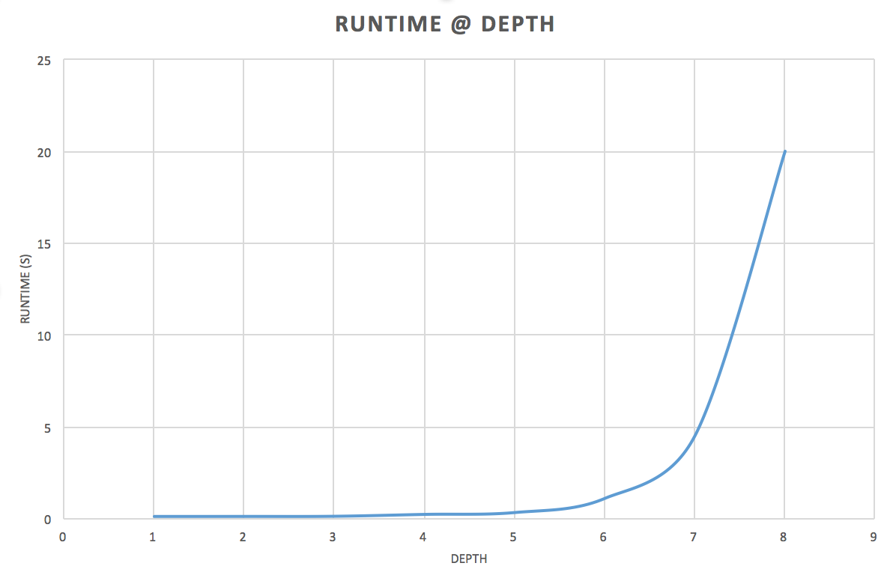

# Kalah AI
##### Jake Garrison, EE 562

## Summary
In this project, I attempt to create a Kalah AI that is as good or better than a human player. Some details about Kalah is that beads get evenly distributed around the board each turn, and into the players score kalah if it passes it. Some other details include special conditions that may allow the player to play again or steal beads from the opponent. The goal of the game is to collect the most beads in the player's respective kalah.

This game has a max branching factor of 6 (6 move possibilities per player) and ends when a player has at least 37 beads in their kalah. The game complexity tends to reduce as the game progresses since pits may run out of beads, reducing the space of possible moves.

This report will address my implementation details by explaining the search process, heuristic score, and results

## Search Process
I used minimax search to see which move would result in the best outcome for the player. Minimax assumes the opponent is also optimal and plays several turns based on the defined depth and then returns the move with the highest score as defined by the heuristic function. I made some tweaks to the standard implementation. First I added alpha-beta pruning to skip over certain paths that are guaranteed to no yield an optimal score. Next, I considered the kalah rule where if a player's last bead lands in their kalah, they move again.

I altered minimax to not alternate the player from max to min if the max player can move again. My reasoning for this is when the player can move again, there is no reason to evaluate the min player's counter move since they aren't given one until after the max player finishes their turn. This is important since my heuristic prioritizes moves in which the player can move again.

In order to reduce the time to return the ideal move, I evaluated the player's possible moves on independent processes using python's `pool.map`. This got complicated due to the way python 2.7 handles multiprocessing (I am more familiar with python 3 for this). The solution was to add the helper function `process` outside of the class. This speeds up the runtime significantly, but approximately 3x when the depth is 6. This enabled me to use a greater depth in the same amount of time!

I also added an exit counter to make best used of the 1 second move time specified in the tournament. The exit counter stops recursion at a specified time. `0.86` seconds was empirically found to be ideal for this problem. The reason it isn't exactly 1 is because when recursion stops, the program must run back up the stack to evaluate all leaves (moves) up to that point. More info is given in later sections

I attempted to implement a dynamic depth that conditionally changes the depth based on the state of the game. This relied on a separate depth heuristic that aimed to suggest a search depth based on the board state. I found that the optimal move is evaluated faster later in the game due to fewer combinations of possible moves. The idea of this was to make full use of the time limit per move. I present my results in later sections.

I am sure there are other conditional search optimizations that can be added, but I didn't have time to explore this. If only it wasn't during midterms week...

## Heuristic
The obvious starting choice for the heuristic is to prioritize moves that result in the highest score (beads in kalah) for that player. I used this while developing, with the intention of tweaking and improving it once the code was functional. I read some papers about the game and it seemed like moves can be broken into a few categories:

* **defense**: player moves beads on their side, but doesn't score
* **scoring**: player moves beads and scores
* **repeat**: player moves beads such that they can move again
* **steal**: player moves beads such that they steal from opponent

After playing the game a few times, I realized keeping beads on your side is strategic because they are more likely to end up in your kalah. This prompted me to adjust my heuristic to include the loss of beads to the opponent. So far I am looking at the score, and loss.

Next, I considered the special conditions, moving again, and stealing beads, both of which are ideal for the player. I labeled these again and stolen respectively.

So the inputs to my heuristic ended up being metrics that are positive for the player: score, again, stolen and then loss, which is negative.

My heuristic needed to return something of the form:
<br>`heuristic = a*score + b*again + c*stolen - d*loss`<br>
where the weights `a, b, c, d` needed to be set.

I initialized the weights to 1 and then did a manual genetic/ reinforcement learning type algorithm in which I played variants of the same AI against each other and evolved upon weights that tended to produce victories. Unfortunately, this was a slow process since the game is GUI based and each match had to be set up manually (I didn't have time to make my own game that can run from the command line). I probably ran around 100 iterations of weights, then reached the following conclusion. It was difficult towards the end because often times there would not be a distinctive winner between the two AIs being compared. I tried a best of three type approach, but sometimes the winner may have been due to chance to some degree.

I found the weights of loss and score to be ideal when they were about the same, so I set them to one and then optimized the remaining ones based off this

I noticed putting more weight on `again` and `stolen` increased the chance of winning, and I empirically found that squaring the sum of `again` and `stolen` helped prioritize the selection of these type of moves. I also experimented with cubing and other factors. I wanted to keep the heuristic simple since it affects the run time of the program.

My final heuristic ended up being:
<br>`heuristic = (again + stolen)**2 + score - loss`<br>

## Experiments
#### CPU time
* Using a similar PC as tournament one: `Intel i7-4770 @ 3.40 GHz` and evaluating a single move.
* Observation: Python 3 version is faster due to better multiprocessing capabilities

Complex state evaluated:
```
a = [9, 8, 8, 1, 2, 1]
b = [9, 3, 1, 3, 11, 11]
a_score = 3
b_score = 3
```

The time is an average of 3 runs

| Depth    | 1     | 2     | 3     | 4     | 5    | 6    | 7    | 8  |
|----------|-------|-------|-------|-------|------|------|------|----|
| Time | 0.138 | 0.140 | 0.148 | 0.250 | .350 | 1.12 | 4.53 | 20 |




#### Dynamic depth
As mentioned above I attempted a dynamic depth which relies on a depth heuristic, Unfortunately, I could not come up with a heuristic that I could map to a depth. I wanted to pass the state of the game to this heuristic and return a score and then use that score to map to a depth choice. In my testing at depth 6, I found early in the game it takes > 1 second, and later in the game, it is < 0.3 seconds. Ideally, early in the game, the depth could be 5, then switch to 6, then 7 and maybe 8 as the game progresses.

Some heuristics I tried were counting the pits with 0 beads since a higher number of zeros would yield faster computation (less moves in the moving space). I also tried summing both players kalah scores since that indicates the game progress. Finally, I tried combining them in several ways. What I was hoping for was a linear relationship between my heuristic and the elapsed time of finding a move. Here is what I got:


With this information, it is difficult to change the depth based on the score, since points with the same depth score a mapped to very different times. While I'm sure there is a heuristic that is ideal fro this problem, I didn't have time to explore one. Instead, I opted to stick with the exit counter.

### Exit counter
I found the exit counter to be a good compromise between time and search depth. When elapsed time is greater than a specified value,  the search stops and the recursion stack is evaluated at that point. I found the time needs to be around 15% less than the desired search completion time since the heuristic must be evaluated for all leaf nodes up to that point. One concern is that nodes early in the search get fully expanded, while nodes later in the search get cut off. This gives an unfair bias towards earlier nodes. In my implementation nodes are evaluated from move 0 to 6, so the lowered number moves get fully analyzed. Since one strategy is to keep beads on the player's side, it is generally good to choose lower numbered pits for a move. Also based on my findings above at depth 6, only a fraction of the moves early in the game take longer than 1 second, so these would be the moves that are cut short. Since it is early in the game, it may be less critical to fully search the space. For this reason, my exit counter is set to exit such that at depth 6, all moves are < 1 second (for the tournament). Hopefully, this is true on the competition PC. 

### Effectiveness
##### Against random agent
The AI was able to beat a random agent 5/5 times.

##### Against Me
Given that I programmed it, I use a similar strategy. I found that the AI was difficult, but sometimes I could trick it to steal a lot of beads and win. In general, I struggled to beat it. I won 3/10 times.

##### Against another human
I taught a friend to play and they beat it 1/5 times

## Conclusion
My AI features minimax search algorithm with alpha-beta pruning. Each possible move is evaluated as a separate process which speeds up computation by 3 fold and allows me to use a depth of 6. If a particular move search takes longer than 1 seconds, the search is cut off and returns the best move up to that point. My heuristic function went through several iterations and is at a point that seems to be better than other versions I tested. Other strategies were looked at, such as dynamic depth, but was not used due to lack of time and a usable heuristic.
